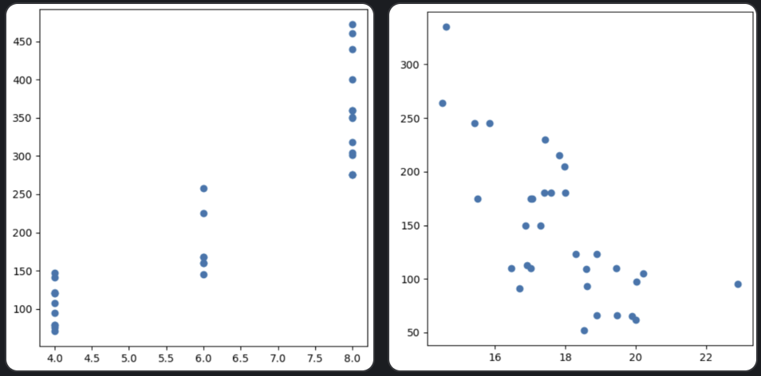

## W1M1

> **1. 이런 데이터셋을 분석해서 얻을 수 있는 경제적 가치는 무엇일까요? 어떤 비즈니스 상황에서 이런 데이터셋을 분석해서 어떤 경제적 가치를 얻을 수 있을까요?**

**신차의 스펙을 기반으로 출고가를 정할 수 있음**
- 추가로 필요한 데이터 : 출시된 차량의 출고가 및 순수익
- 경제적 가치 : 출시된 차량 데이터를 기반으로 최대의 이윤을 내는 출고가를 정할 수 있음


**고객이 선호하는 차량 스펙을 기반으로 신차 스펙을 정할 수 있음**
- 추가로 필요한 데이터 : 출시된 차량의 출고가 및 순수익, 제조 비용
- 경제적 가치 : 판매량, 출고가 및 스펙을 기반으로 고객군을 분류하여 타겟팅 가능
- 출시된 차량보다 좋은 스펙과 유사한 가격으로 출시하여 고객 유치


> **2. 변수들 간의 상관 관계가 높은 조합을 임의로 2개 선택해서 해당 데이터 간의 상관 관계를 그래프로 그리고 어떤 결론을 내릴 수 있는지를 토의하세요**

- 실린더(cyl)가 증가하면 배기량(disp) 증가
- 1/4마일 가는데 걸리는 시간(qsec) vs 마력(hp)

```python
      plt.figure(figsize=(5, 5))
      plt.scatter(df['cyl'], df['disp'])
      plt.tight_layout()

      plt.show()
     
      plt.figure(figsize=(5, 5))
      plt.scatter(df['qsec'], df['hp'])
      plt.tight_layout()

      plt.show()
```



---
## W1M2

> **1. 각자가 이해하기 어려웠던, 또는 이해하지 못한 keyword에 대해서 함께 토의해 봅시다. 그 결과를 개인 위키에 기록하세요.**

- W1M2에서 SQL 기초를 중점으로 학습하였다. 그래서 이해하지 못한 용어는 없었고, 대신에 추가적인 학습을 진행하였다.
- 학습 내용에 주어진 INNER/LEFT/RIGHT/FULL JOIN 이외의 CROSS JOIN에 대해 학습하였다.
- ROW_NUMBER() OVER()과 같은 윈도우 함수를 학습하였고, 시간 복잡도는 어느 정도 될지 이야기해보았다.


---
## W1M3
> **1. wikipeida 페이지가 아닌, IMF 홈페이지에서 직접 데이터를 가져오는 방법은 없을까요? 어떻게 하면 될까요?**

- IMF Data API를 활용한 데이터 수집
    - IMF Data APIs [ SDMX ] : https://data.imf.org/en/Resource-Pages/IMF-API <br>
    → python을 활용한 API 요청 및 수집 가능

> **2. 만약 데이터가 갱신되면 과거의 데이터는 어떻게 되어야 할까요? 과거의 데이터를 조회하는 게 필요하다면 ETL 프로세스를 어떻게 변경해야 할까요?**

- SCD (Slowly Changing Dimension) Type 2 적용
- 테이블에 start_date, end_date 컬럼을 추가하여 해당 데이터가 유효한지 명시한다. 새로운 데이터가 들어온다면, 이전에 존재했던 데이터의 end_date와 새로운 데이터의 start_date를 현재 날짜로 수정하여 데이터 정합성을 유지한다.
    - start_date, end_date를 사용하지 않고 오직 is_current 컬럼만으로도 유효한 데이터인지 판별할 수 있겠지만, 해당 데이터가 저장된 시점을 확인하며 사용하기 위해서는 start_date, end_date 컬럼을 추가하는 것이 더 적절하다고 판단된다.


> **3. 팀원들과 아래 내용을 다시 읽고 그 함의에 대해 논의해 보세요.**
>
> **W1M3의 시나리오**
>
> 당신은 해외로 사업을 확장하고자 하는 기업에서 Data Engineer로 일하고 있습니다. 경영진에서 GDP가 높은 국가들을 대상으로 사업성을 평가하려고 합니다.
>
> 이 자료는 앞으로 경영진에서 지속적으로 요구할 것으로 생각되기 때문에 자동화된 스크립트를 만들어야 합니다.<br>
> W1M3처럼 추가 요구사항'이 있는 경우, 코드 관리를 어떻게 하면 좋을지 팀원들과 상의해 보세요.

- 확장성 : 재사용이 핵심
    - 함수화, 모듈화, 클래스화
- 안정성 : 유지보수가 핵심
    - 로그, 에러 처리, 중간 결과 저장 (임시 파일) → 중복 실행 방지, 실패시 재실행