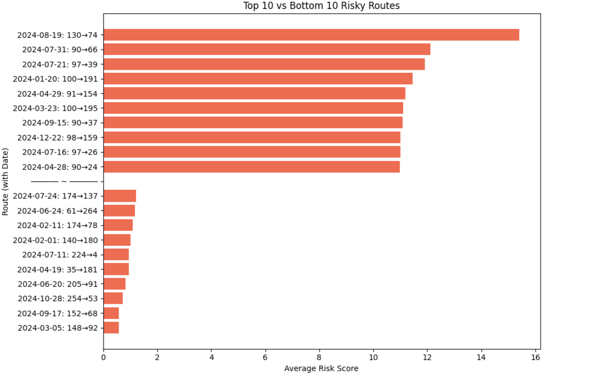

## 문제 정의

### 주제

**도로 위험 구간 자동 탐지 및 시각화 시스템**

---

### 누구의 문제인가?

인구 10만명 이내의 소도시 지자체 도로시설과

---

### 어떤 상황인가?

지방 소도시에서는 실제로 도로에 위험 요소가 존재해도, 신고되는 경우는 매우 드물다. 이로 인해 도로 상태로 인한 부상자가 지속적으로 발생하고 있으며, 사고가 난 뒤에야 처리되는 경우가 많다. 따라서, 사고가 발생하기 전에 미리 위험 요소를 발견하고 예방 조치를 취할 수 있어야 함.

도로 담당 부서는 직접 보수 예산을 집행하고 인력을 투입해야 함.

도로 안전을 확보하고, 위험 구간을 빠르게 식별해 조치해야 하는 의무가 있음.

근거자료

- https://www.nongmin.com/article/20241008500176
- [https://www.ruralhealthinfo.org/rural-monitor/road-safety](https://www.ruralhealthinfo.org/rural-monitor/road-safety?utm_source=chatgpt.com)

---

### 어떤 문제를 겪고 있는가?

CCTV나 수동 점검 방식을 통해 전체 도로를 전수 조사하기엔 비용과 시간이 많이 듬

---

### 해결책?

자율주행차에 탑재된 다양한 센서 데이터를 통합적으로 분석하여, 도로의 위험 구간을 자동으로 탐지하고 Heatmap 형태로 시각화한다.

- 차량 센서 데이터(급정거, 급가속 기록)를 통해 돌발 상황을 인지하고,
- 차량 레이더 및 카메라로 탐지된 장애물, 무단횡단자, 갑작스러운 진입 차량 등 시야 기반 위험 요소를 추가로 반영한다.
- 진동/타이어 슬립 센서를 활용해 포트홀이나 미끄러운 노면 등 도로 상태를 분석하고
- GPS 데이터로 위치를 정밀하게 매핑하여 위험도가 특정 구간에 정확히 누적될 수 있도록 한다.
- 마지막으로, 시간 및 날씨 정보를 연계하여 시간대나 기상 조건별 사고 가능성을 가중치로 적용한다.

---

### 기대 효과

- **데이터 기반 보수 우선순위 설정**으로 예산 효율화
- **사고 전 예방** 중심의 도로 안전 관리 가능
- **민원 발생 전 사전 대응 체계 구축**
- **도로 안전지수 향상** 및 시민 체감 안전도 증가
- **자율주행차·배달 오토바이 등 실시간 경고 시스템과 연계 가능**

인구 10만 명, 면적 569km² 규모의 보령시 기준으로 약 1억 원 
(도시 규모나 예산 금액에 따라 상하로 조정될 수 있음)

https://safety.brcn.go.kr/download/kor/cmpl/2025_pdf/E-22.pdf

### Prototype

위의 데이터가 없기 때문에
차량의 출발·도착 지점과 시간, 위치 정보를 기반으로 각 구간별 위험도를 누적 산출한다.

→ 이걸로 접근하고 → 더미데이터로 위험횟수 몇번 있었는지만 추가하여 산출한다. 

특정 지역에는 높은 숫자 그 외 지역은 일부로 낮은 숫자. 

데이터가 차량 출발/도착 지점과 시간, 날씨

특정 위치/시간에서 위험도 평균이 높도록 더미 데이터 생성

1. PULocationID가 90~100이면 높게 (위험지역임, ex. 산사태 자주 발생 / 평균 2점)

2. between("2024-08-18", "2024-08-22")(("PULocationID") == 130)) & ((col("DOLocationID") == 74))에 포트홀 생겼다고 가정

